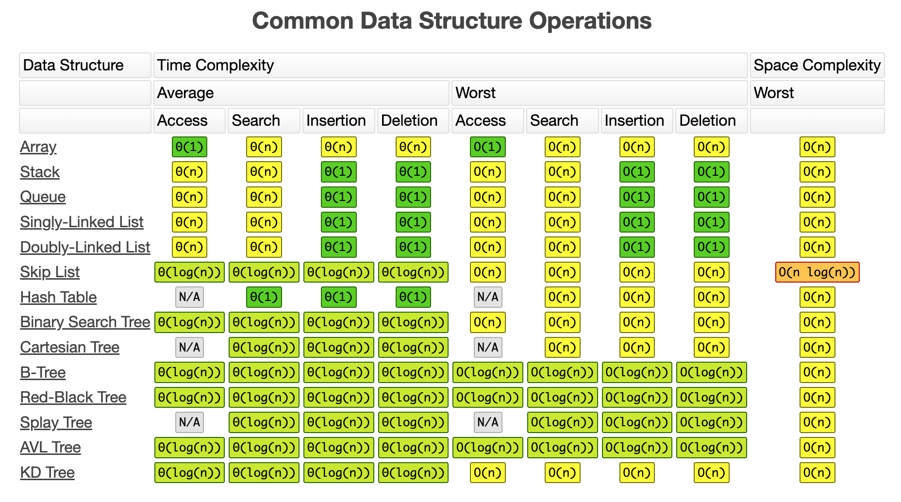

# final exam topics

## essay questions
- Value of implementing Data Structures and Code reuse. These questions are sort of ‘in your opinion’ questions and what I would be looking for is to use your knowledge of those topics and provide to me a response of a particular question. No coding required for those two questions.
    - data structures: These are tried-and-true structures that are implemented in the most efficient way that has been discovered so far! Almost all big modern languages already have implementations of these structures. Most programmers know how to use them, so using them increases code clarity when someone reads the code using these structures. Some problems are uniquely suited to these structures as well. Scheduling tasks, for example, works just like a queue does, making it a perfect problem to use queues for. Using these out-of-the-box implementations also aids with code-reuse...
- Know...
    - the ‘Shunting-yard algorithm’
        - infix: 3 + 7 * 2 - 8 / (6 - 2)
        - postfix: 3 7 2 * + 8 6 2 - / -
        - steps
            - add each number to the stack, one by one
            - when you reach an operator, pop off the two top numbers, perform the operation, and add the result back to the stack
            - there should be only one number on the stack at the end, and that's the answer to the problem
    - the idea of semaphores
    - the shortest path algorithm
    - the structured programming movement
        - make code as modular as possible so that it's clear and easy to modify
        - elements: control structures, subroutines, blocks

## short answer questions
1) Queue principles
2) Adapter design principles
3) Decorator design pattern principle
4) ArrayList principles
5) LinkedList principles
6) Know your interfaces and what they do: iterator, iterable, listIterator, Collection, list
7) Time complexity for Array, List, Stack, Queue

## multiple-choice
1) ArrayList and LikedList efficiencies - efficiencies for removing, adding, etc.
2) Choose best collection to apply to a given situation: storing payroll calculations, program to track progress in a maze, keeping track of customers in alphabetical order, driving dispatching system like Uber.

Basically make sure you know the ins and outs of the following data structures: ArrayList, LinkedList, Queue, or Stack.

## coding problems

### Decorator Pattern problem
1) Description: Need to create a system to allow for basic seat reservations and decorations for adding wifi.
2) You're given a UML diagram where you'll need to implement a few classes.
3) What you need to do is to look at the UML diagram and simply implement the methods using the decorator method.
4) You will be given a sample of what your output should look like.
5) You will be given a 'RunMe.java' file with starter code.
Go over what the Decorator classes do:
1) Remember to declare your main object, FightSeat.
2) Then just code up your getters and remember to instantiate the constructor for the classes extending the decorator classes.
3) Call the super class (FlightSeatDecorator) and do your modifications locally.

### Stacks problem
1) Description: The given problem is about balancing parentheses, obviously you have to make sure each parentheses has its open and respective closed parentheses.
2) Example: [{}], {}, ([{}]) are balanced, [{}, {, ({) are NOT.
3) Using a stack you need to check if a particular string is balanced or not. Return a true or false.
4) Tips: perhaps a string of opening strings, like {({.
5) Have a string of closing strings like })].
6) What you need to do is to iterate through the tokens.
7) If the tokens are starting strings then push to the stack.
8) If not then see that means it is an ending string so see if that particular string matches the top of the stack.
9) Work your way through the rest of the tokens.
10) Return false if any of the above steps don't work.
11) If the stack is empty then you know it's true, so return that.
12) Conclusion: know how stacks work and know your stacks methods: empty(), push(), pop()

### Queues problem
1) Description: Need to implement a publish/subscribe model (like YouTube, etc.) by implementing two classes.
2) Will be given a UML diagram for the methods and variable for each class you need to implement. There are links to APIs you may need embedded in the specification.
3) You will be given a Queue object of a particular class will need to do such things as reading and removing oldest notifications (poll), getting number of notifications(size),
check if two subscribers are equal.
4) Conclusion: pretty simple problem, know how to use poll and size methods of queue.

### Lists problem
1) Description: Implement two methods using the List class. Links to the applicable Java API will be available.
2) You will do the following:
- Reverse a list in place in O(n) time, should not need to create any new lists.
- Merge two sorted lists in O(n+m) time. Same as what was done in the Polynomial HW. result should be ordered ascending.
3) Need to know the following interfaces: List and ListIterator methods and understand what they do.
3) So how do you reverse a list?  Possibly have two list iterators from List class and iterate between both lists with one list starting from the end?
4) How do you merge a list?  May need to do some comparisons. Again call list iterator from each list.
5) How do you declare a ListIterator obj? `ListIterator<E> blah = somelist.listIterator();`
6) Then manipulate blah to do the merge operation. You're comparing each letter in each list to see if one comes before the other in alphabet and take that one and add to result.
